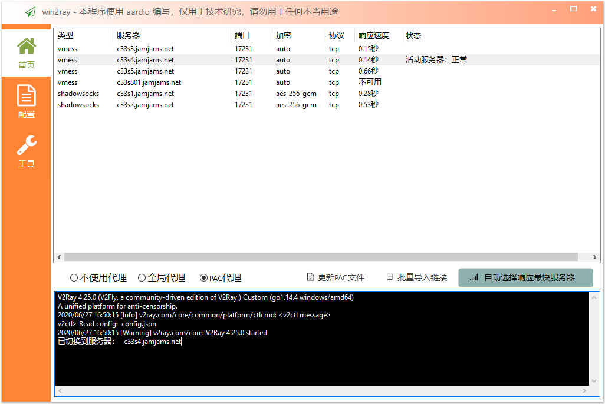
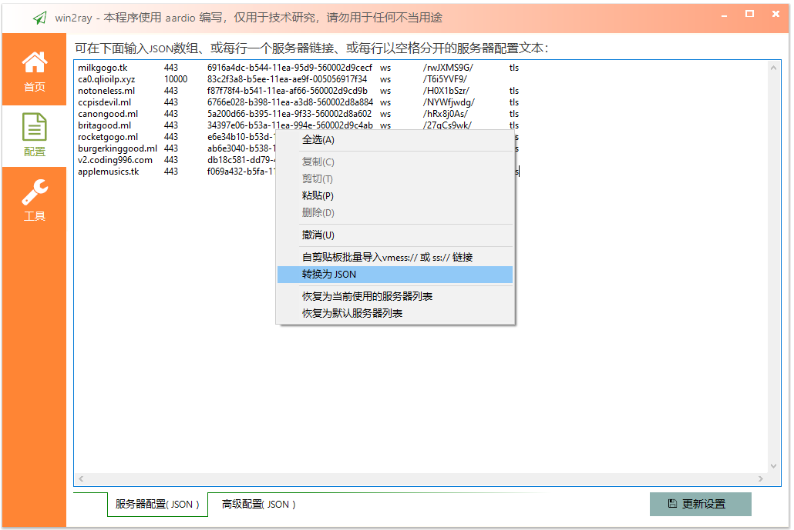
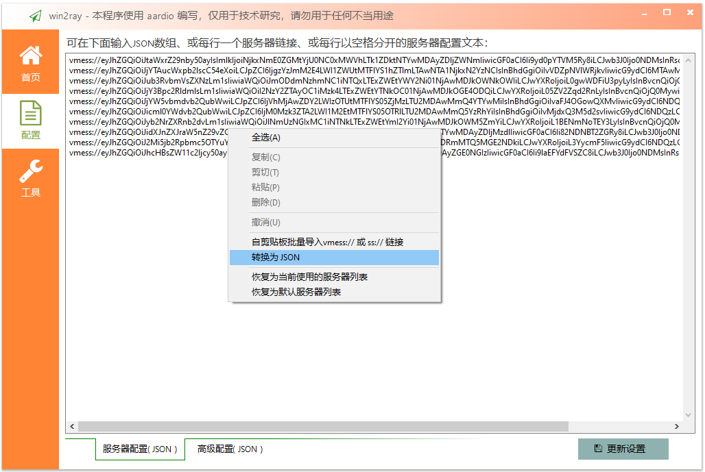
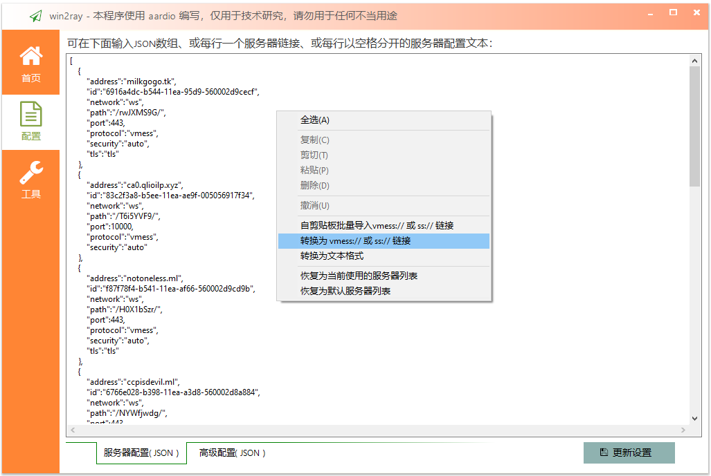

# win2ray 
简洁稳定的 V2Ray Windows 客户端，     
本程序使用 [aardio](http://www.aardio.com) 编写，不需要.Net运行库，生成的EXE非常小。    

软件首次运行时会在当前目录查找 "./v2ray-core/v2ray.exe"   
发行文件仅需要 "./win2ray.exe"，可选带上 "./v2ray-core/" 目录（ 如果没有找到会自动到v2ray官网下载，不过没有代理服务器下载有时候非常慢 )。

win2ray 支持批量测试服务器，并选择响应最快的进行连接，启动软件时也会自动连接响应最快的服务器。  
设置活动服务器以后，也会在数秒内自动检测访问国外网站是否正常，如下图：

批量导入各种格式的服务器配置，支持json、vmess链接、ss链接、文本表格格式服务器列表等。  
可选在 ["/v2ray-core/win2ray-default-servers.txt"](./v2ray-core/win2ray-default-servers.txt) 文件中添加默认服务器列表（生成EXE后默认配置自动嵌入到EXE文件，可选删除该文件,也可以继续使用该文件覆盖EXE自带的默认服务器列表）。

